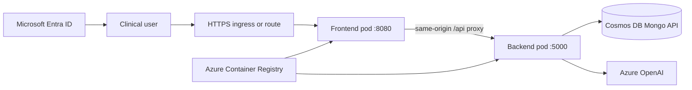

# OpenShift to AKS Clinical Unit Pilot

Terraform and deployment automation for comparing Azure Kubernetes Service (AKS) with Azure Red Hat OpenShift (ARO) using the same Clinical Unit application.

The application runs as exactly two workload pods:

- `clinical-unit-frontend`: React/Vite static site served by unprivileged NGINX
- `clinical-unit-backend`: FastAPI API using Azure Cosmos DB for MongoDB and Azure OpenAI

This repository was shaped by the August 10, 2026 inventory-backed modernization guide. It treats this application as a bounded DEV pilot: validate discovery, image portability, identity, ingress, automation, and operations before selecting a production target or scheduling broader migration waves.

## Architecture



The shared foundation is provisioned once. AKS and ARO are separate Terraform states and can be created or destroyed independently.

| Stack | Creates |
|---|---|
| `terraform/foundation` | Resource group, ACR, Log Analytics, serverless Cosmos DB Mongo API, Azure OpenAI |
| `terraform/aks` | VNet, AKS with Cilium/Overlay networking, Entra/Azure RBAC, policy, monitoring, managed NGINX routing |
| `terraform/aro` | VNet, dedicated Entra service principal, Azure Red Hat OpenShift cluster, ACR access |
| `k8s/base` | Namespace, service account, two Deployments, two Services, network policies |
| `k8s/overlays/aks` | TLS Ingress for AKS |
| `k8s/overlays/aro` | Edge-terminated OpenShift Route and ACR pull-secret binding |

## Start Here

1. Read the platform runbook:
   - [AKS deployment guide](docs/AKS.md)
   - [Azure Red Hat OpenShift deployment guide](docs/OPENSHIFT.md)
2. Create an encrypted remote Terraform backend with `scripts/Initialize-TerraformBackend.ps1`.
3. Apply `terraform/foundation`.
4. Apply `terraform/aks`, `terraform/aro`, or both.
5. Build and push the two images with `scripts/Build-Images.ps1`.
6. Deploy with `scripts/Deploy-Workload.ps1`.

## Prerequisites

- Azure subscription with quota for the selected cluster and Azure OpenAI model
- Azure CLI and an authenticated session (`az login`)
- Terraform `1.8` or newer
- Docker
- `kubectl` and `kubelogin` for Entra-only AKS access; the OpenShift CLI (`oc`) is recommended for ARO administration
- GitHub SSH access to:
  - `ctava-msft/clinical-unit-frontend`
  - `ctava-msft/clinical-unit-backend`
- Microsoft Entra SPA app registration and tenant ID
- DNS name and TLS certificate for AKS; ARO supplies a default route hostname and certificate

## Security Notes

- Never commit `.tfvars`, backend files, pull secrets, certificates, or Terraform state.
- The backend bootstrap grants its operator `Storage Blob Data Contributor`. Use `-PrincipalObjectId` and `-PrincipalType ServicePrincipal` for CI rather than a signed-in user.
- ARO requires a client secret and the current backend application requires Cosmos DB and Azure OpenAI keys. These values are stored in Terraform state. Use the encrypted Azure Storage backend in the runbooks and restrict its RBAC.
- The pilot permits shared Azure-datacenter access to Cosmos DB so either cluster can connect. Replace this with private endpoints and private clusters before production.
- The frontend repository currently has no lockfile and does not pass its TypeScript build. The image builder applies the reviewed patch and lockfile in `containers/frontend` to its ephemeral checkout. Upstream those fixes before production, then remove the migration patch.
- The backend repository deletes its required Mongo `_id` shard key before upsert. The image builder applies the narrow correction in `containers/backend/source.patch`; upstream it before production.
- Image builds target `linux/amd64` by default because the selected AKS and ARO VM SKUs are AMD64, even when Docker runs on an ARM64 workstation.
- The frontend lockfile is registry-neutral. `Build-Images.ps1` defaults to public npm; pass `-NpmRegistry` when an approved mirror is required.
- The backend image installs the API runtime subset in `containers/backend/requirements-runtime.txt`; notebook and evaluation packages from the source repository are intentionally excluded. Pass `-PythonPackageIndex` for an approved PyPI mirror.
- The current application accepts a Microsoft Graph access token at the backend. Before production, expose a dedicated API scope and have the frontend request that audience.
- The manifests intentionally use one replica per component to meet the two-pod pilot requirement. Production should use multiple replicas, disruption budgets, autoscaling, tested recovery objectives, and managed secret delivery.

## Validation

The repository includes portable Kustomize overlays. Render them without a cluster:

```powershell
kubectl kustomize k8s/overlays/aks
kubectl kustomize k8s/overlays/aro
```

Validate each Terraform root after initialization:

```powershell
terraform -chdir=terraform/foundation validate
terraform -chdir=terraform/aks validate
terraform -chdir=terraform/aro validate
```

After deployment, both platforms must report exactly two active application pods:

```powershell
kubectl get pods -n clinical-unit -l app.kubernetes.io/part-of=clinical-unit
```

## Cost Warning

ARO is not a small local-style OpenShift cluster. It creates three control-plane VMs and at least three worker VMs. AKS, ARO, Azure OpenAI, Cosmos DB, and log ingestion incur charges until destroyed. Review every saved plan and follow the runbook cleanup steps after the pilot.